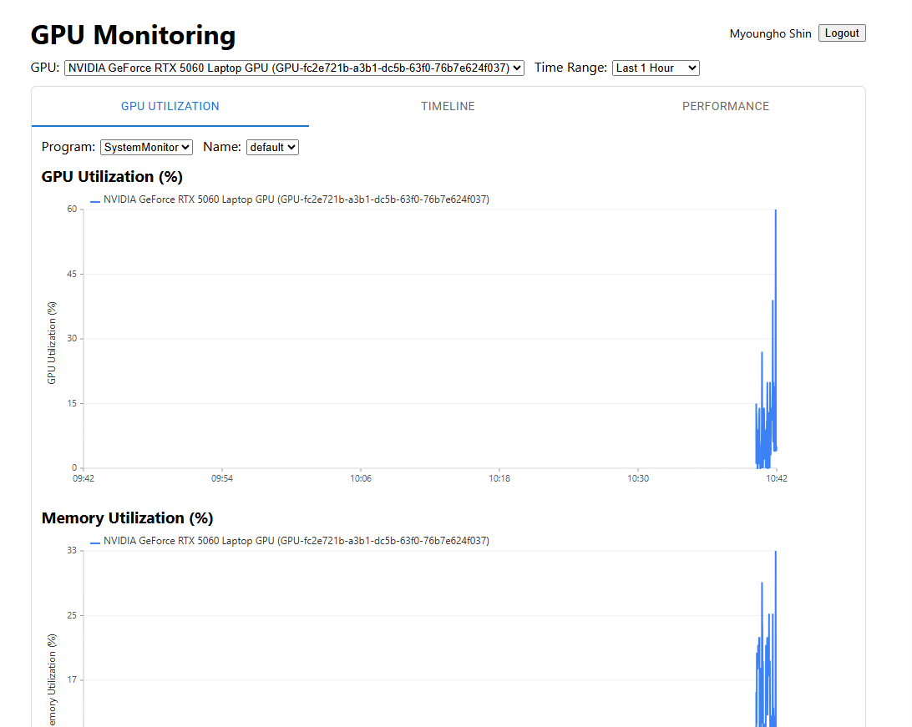
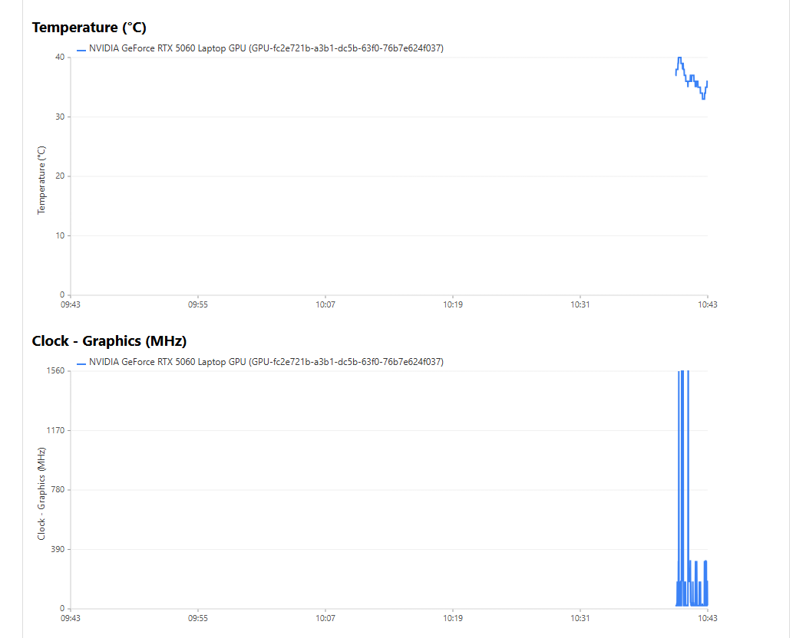
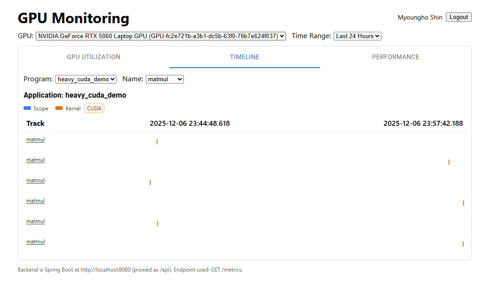
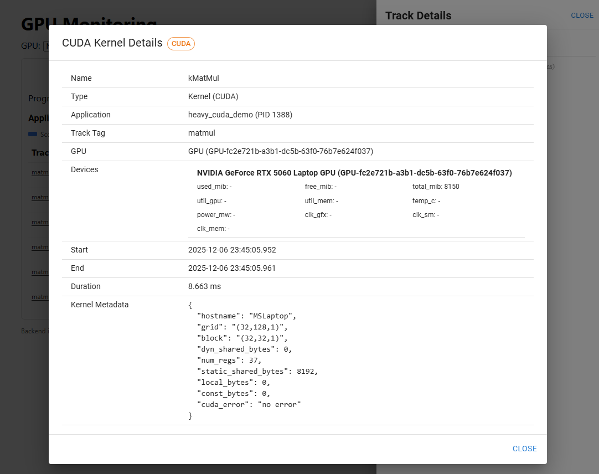
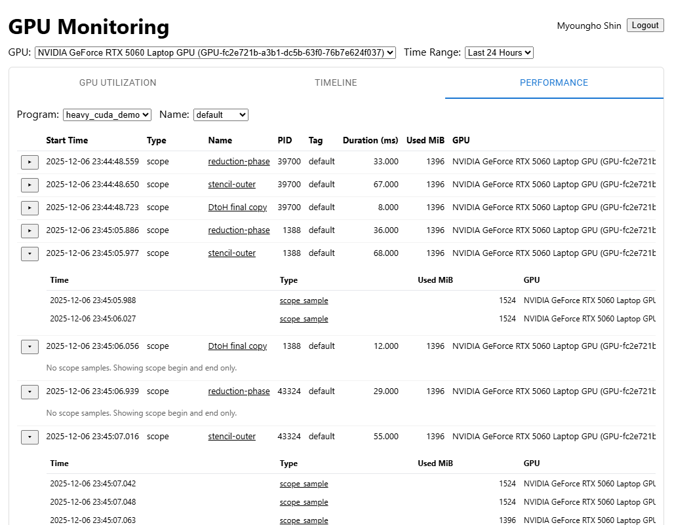

# GPU Monitoring 
EN.605.617 – Introduction to GPU Programming – Final Project.








## How to run
This repository has three parts that work together:
- backend (Kotlin + Spring Boot + SQLite) – receives and serves GPU metrics
- crawler (C++/CUDA + NVML) – collects GPU metrics and sends them to the backend
- frontend (React + Vite) – visualizes metrics as a time-series chart

Below is a quick start to run all three on Windows.

Note:
- crawler has most GPU related codes

## Prerequisites
- Java 17+ and Maven 3.9+
- Node.js 18+ and npm
- NVIDIA CUDA Toolkit (for NVML) – make sure the version/path matches `crawler/CMakeLists.txt`
- A compiler/toolchain that works with your CLion CMake profile (provided by this project)

## 1) Start the backend (Spring Boot)
In a terminal (PowerShell):

```
cd webservice
mvn spring-boot:run
```

Backend will listen by default on http://localhost:8080. You can check health at http://localhost:8080/health.

Environment (optional):
- server.port – server port (default 8080)
- spring.datasource.url – JDBC URL for SQLite (default `jdbc:sqlite:metrics.db`)
- spring.jpa.hibernate.ddl-auto – `update` by default

Alternatively, build a jar and run:

```
cd webservice
mvn -DskipTests package
java -jar target/webservice-*.jar
```

## 2) Start the frontend (dev)
In another terminal:

```
cd webservice\frontend
npm install
npm run dev
```

Open the printed URL (default http://localhost:5173). The dev server usually proxies API requests to `http://localhost:8080` (configured in `webservice/frontend/vite.config.ts`).

If your backend runs elsewhere, edit the proxy target in `vite.config.ts`.

## 3) Build and run the crawler
The repository includes a CLion CMake profile named "Debug" with a pre-generated build directory. Use it to build the `crawler` target.

From a terminal (PowerShell), using the active CLion profile:

```
cmake --build [crawler folder]/cmake-build-debug --target crawler; 
& [crawler folder]\cmake-build-debug\crawler.exe
```

Notes:
- NVML library and include paths are configured in `crawler/CMakeLists.txt` for CUDA v12.8. If your CUDA is installed to a different path/version, update:
  - `HINTS "C:/Program Files/NVIDIA GPU Computing Toolkit/CUDA/v12.8/lib/x64"`
  - `CUDA_INCLUDE_DIR "C:/Program Files/NVIDIA GPU Computing Toolkit/CUDA/v12.8/include"`
- The crawler posts JSON metrics to `http://localhost:8080/metrics` by default. To change the destination, set environment variable `METRICS_ENDPOINT` before running the crawler (e.g., `http://host:port/metrics`).

## 4) Verify everything works
- Open http://localhost:8080/health – should return `{ "status": "ok" }` once the DB is initialized.
- Open the frontend (http://localhost:5173). After the crawler sends data, the GPU selector should list at least one GPU from `/gpus`, and the chart should show points for the chosen metric/field.

## Troubleshooting
- Frontend shows error fetching API:
  - Ensure the backend is running on port 8080.
  - If using a different port/host, update the proxy in `webservice/frontend/vite.config.ts`.
- No GPUs or no data points in the chart:
  - Ensure the crawler is running and successfully posting (`METRICS_ENDPOINT` correct, backend reachable).
  - Check backend `/metrics` and `/gpus` endpoints in the browser.
- CMake/NVML errors when building crawler:
  - Update CUDA paths in `crawler/CMakeLists.txt` to match your installed CUDA version.
  - Ensure you have a supported compiler and the Windows SDK installed.
- Port conflicts:
  - Backend default: 8080 (change with `server.port`)
  - Frontend dev server: 5173 (change with Vite `server.port`)

## Production build of frontend
```
cd webservice\frontend
npm run build
npm run dev
```
This serves the static build on port 5173 for a quick preview. In a real deployment you would serve `webservice/frontend/dist` with a static server or behind your backend/reverse proxy.
